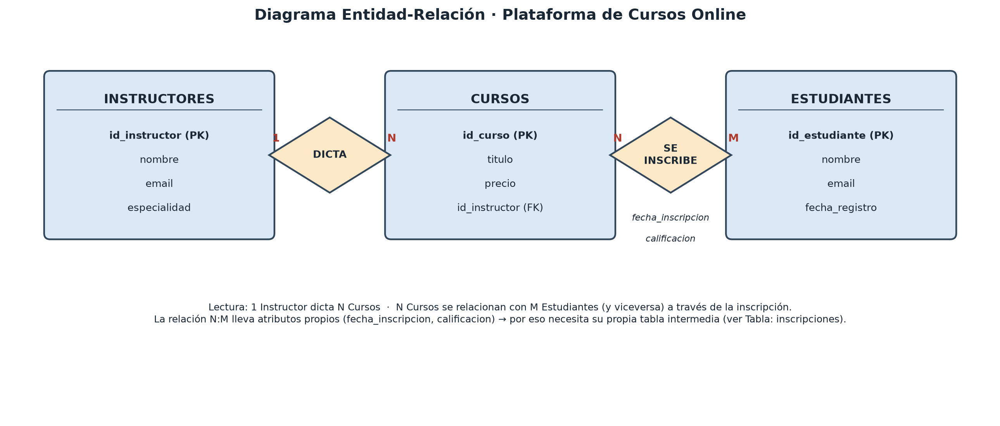

# Práctica 3: Diseño de base de datos para una plataforma de cursos online

Caso: plataforma de cursos online (estilo Udemy/Coursera). Objetivo: traducir
el problema real a un esquema de base de datos técnico (diagrama
Entidad-Relación + conversión a tablas).

Archivos entregables:

- [`diagrama_er_cursos.png`](diagrama_er_cursos.png) — solo el diagrama ER (para subir como imagen).
- [`diseno_bd_cursos.pdf`](diseno_bd_cursos.pdf) — diagrama ER + conversión a tablas (2 páginas), el entregable completo.
- [`generar_diagrama.py`](generar_diagrama.py) — script que genera ambos archivos con `matplotlib`.

## Paso 1: Entidades, atributos y relaciones

**Entidades y atributos** (la PK de cada una está marcada):

| Entidad | Atributos |
|---|---|
| **Instructores** | `id_instructor` (PK), `nombre`, `email`, `especialidad` |
| **Cursos** | `id_curso` (PK), `titulo`, `precio`, `id_instructor` |
| **Estudiantes** | `id_estudiante` (PK), `nombre`, `email`, `fecha_registro` |

**Relaciones:**

- Un **Instructor** *dicta* muchos **Cursos**, pero cada Curso lo dicta un
  solo Instructor → cardinalidad **1:N**.
- Un **Estudiante** *se inscribe* en muchos **Cursos**, y cada Curso tiene
  muchos **Estudiantes** inscriptos → cardinalidad **N:M**. Esta relación
  además tiene sus propios atributos (`fecha_inscripcion`, `calificacion`),
  lo cual es la señal clásica de que necesita su propia tabla intermedia.

## Paso 2: Diagrama Entidad-Relación

Notación Chen: rectángulos = entidades, rombos = relaciones, cardinalidad
indicada en cada extremo de las líneas de conexión.



## Paso 3: Conversión a tablas

| Tabla | Columnas | PK | FK |
|---|---|---|---|
| `instructores` | id_instructor, nombre, email, especialidad | id_instructor | — |
| `cursos` | id_curso, titulo, precio, id_instructor | id_curso | id_instructor → instructores.id_instructor |
| `estudiantes` | id_estudiante, nombre, email, fecha_registro | id_estudiante | — |
| `inscripciones` (tabla intermedia N:M) | id_inscripcion, id_estudiante, id_curso, fecha_inscripcion, calificacion | id_inscripcion | id_estudiante → estudiantes.id_estudiante, id_curso → cursos.id_curso |

La relación N:M entre `estudiantes` y `cursos` se resuelve con la tabla
intermedia `inscripciones`: sin ella, un curso solo podría guardar el id de
un estudiante (o viceversa), y no podríamos representar que muchos
estudiantes cursan muchos cursos a la vez.

## Cómo regenerar los archivos

```bash
python generar_diagrama.py
```
