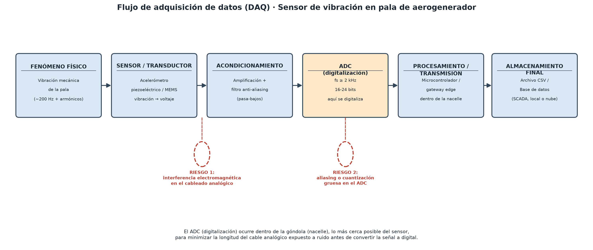

# Práctica 4: Diseño de un sistema de adquisición de datos (DAQ)

Caso: sensor de vibración en las palas de un aerogenerador, en una empresa de
energía eólica. Objetivo: diseñar teóricamente el flujo de adquisición de
datos, desde el fenómeno físico hasta el archivo/base de datos final, e
identificar riesgos de calidad de dato antes de llegar al modelo de Machine
Learning que predice fallos estructurales.

Archivos entregables:

- [`diagrama_daq_aerogenerador.png`](diagrama_daq_aerogenerador.png) — solo el diagrama de flujo (imagen).
- [`diseno_daq_aerogenerador.pdf`](diseno_daq_aerogenerador.pdf) — diagrama + parámetros técnicos + análisis de riesgos (2 páginas), el entregable completo.
- [`generar_diagrama_daq.py`](generar_diagrama_daq.py) — script que genera ambos archivos con `matplotlib`.

## Paso 1: Flujo de adquisición

```
Vibración de la pala (fenómeno físico)
        ↓
Acelerómetro piezoeléctrico/MEMS (sensor/transductor)
        ↓  [RIESGO 1: interferencia electromagnética en el cable analógico]
Amplificación + filtro anti-aliasing (acondicionamiento)
        ↓
ADC — aquí ocurre la digitalización (dentro de la nacelle)
        ↓  [RIESGO 2: aliasing o cuantización gruesa]
Microcontrolador / gateway edge (procesamiento y transmisión)
        ↓
Archivo CSV / Base de datos (SCADA, local o en la nube)
```



## Paso 2: Parámetros técnicos

**Frecuencia de muestreo — recomendado ≥ 2000 Hz.** Por el teorema de
Nyquist, el mínimo teórico para no perder información de una señal de 200 Hz
es 2 × 200 = 400 Hz. En la práctica se usa un margen de 5-10× la frecuencia
de interés, porque las fallas incipientes (grietas) generan armónicos en
frecuencias más altas que la fundamental, y porque el análisis por ML se hace
en el dominio de la frecuencia (FFT/espectrogramas), que necesita esa
resolución extra para no perder esos armónicos.

**Resolución — recomendado 16 a 24 bits.** Los cambios sutiles que
interesa detectar (grietas incipientes) producen variaciones de amplitud muy
pequeñas. Con pocos bits (ej. 8 bits = solo 256 niveles) esas variaciones
quedan por debajo del error de cuantización y se pierden. Con 16-24 bits
(estándar en sistemas de monitoreo de condición industrial) el ruido de
cuantización es lo bastante chico para no enmascarar la señal real.

## Paso 3: Análisis de riesgos

| Punto del flujo | Riesgo | Cómo afecta al dato |
|---|---|---|
| Cable analógico entre el sensor y el acondicionamiento | Interferencia electromagnética (motores, generador e inversores de potencia cerca, dentro de la nacelle) | Se suma ruido eléctrico a la señal real *antes* de digitalizarla — el ADC ya no puede distinguirlo. |
| ADC (digitalización) | Aliasing (fs insuficiente) o cuantización gruesa (pocos bits) | Aparecen frecuencias falsas que no existen en la vibración real, o se pierden variaciones sutiles de amplitud. |

**Impacto en el modelo de Machine Learning:** el principio es "garbage in,
garbage out" — el modelo entrena con lo que efectivamente le llega, no con la
vibración real de la pala.

- Ruido eléctrico → el modelo puede aprender a asociar ese ruido con una
  falla, generando **falsos positivos** (alertas de mantenimiento innecesarias).
- Aliasing o baja resolución → se pierde justo la señal sutil que anticipa
  una grieta, generando **falsos negativos** (no se detecta la falla real a
  tiempo). En un aerogenerador, un falso negativo puede terminar en una falla
  estructural catastrófica — el peor escenario posible para este caso de uso.

## Cómo regenerar los archivos

```bash
python generar_diagrama_daq.py
```
